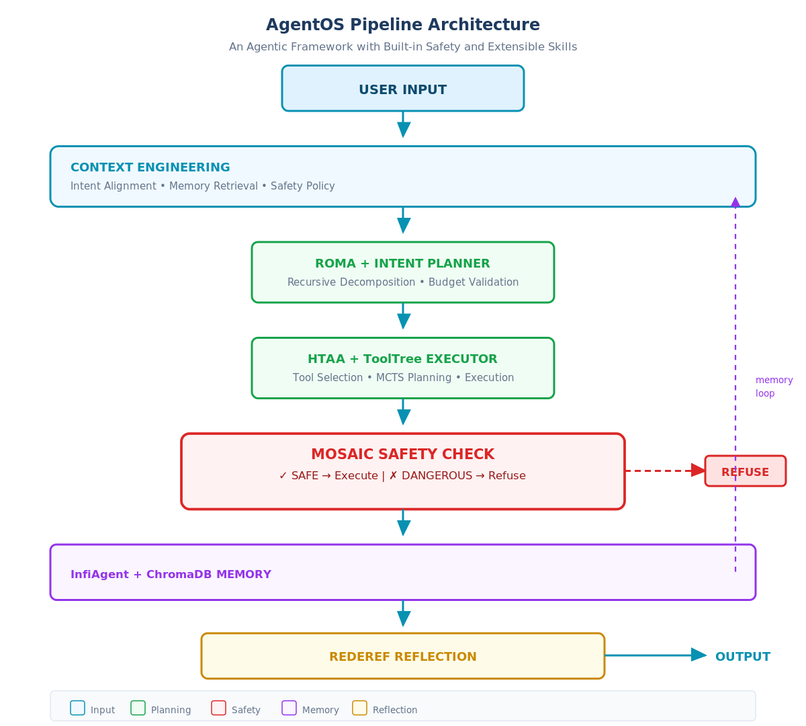

# AgentOS

<p align="center">
  <a href="https://github.com/fikriaf/agentos">
    
  </a>
  
  
  
  
</p>

> **AgentOS** — An autonomous AI agent framework built on cutting-edge research. Built by [fikriaf](https://github.com/fikriaf).

## 🎯 Overview

AgentOS is an **autonomous agent operating system** that integrates 9 state-of-the-art AI agent papers into a production-ready CLI framework. It provides:

- 🔄 **Recursive Task Decomposition** — Break complex tasks into parallel subtasks
- 🛡️ **Safety-First Execution** — MOSAIC-style Plan→Check→Act/Refuse
- 💰 **Budget-Aware Planning** — INTENT-style cost estimation
- 🧠 **Long-Horizon Memory** — File-based state externalization (InfiAgent)
- 🔧 **93 Built-in Skills** — Ready-to-use specialized knowledge

## 📐 Architecture



```
┌─────────────────────────────────────────────────────────────┐
│                      USER INPUT                              │
└─────────────────────────────┬───────────────────────────────┘
                              │
┌─────────────────────────────▼───────────────────────────────┐
│              CONTEXT LAYER (Context Engineering)              │
│  • 93 built-in skills                                       │
│  • Task-aware skill loading                                 │
└─────────────────────────────┬───────────────────────────────┘
                              │
┌─────────────────────────────▼───────────────────────────────┐
│              PLANNING LAYER (ROMA + INTENT)                   │
│  ┌──────────────────┐    ┌───────────────────────────┐    │
│  │ ROMA Planner      │    │ INTENT Budget Tracker       │    │
│  │ Task decomp       │    │ Cost estimation            │    │
│  │ Parallel groups   │    │ Budget constraints         │    │
│  └──────────────────┘    └───────────────────────────┘    │
└─────────────────────────────┬───────────────────────────────┘
                              │
┌─────────────────────────────▼───────────────────────────────┐
│              EXECUTION LAYER (HTAA + ToolTree)               │
│  ┌──────────────────┐    ┌───────────────────────────┐    │
│  │ HTAA Executor     │    │ ToolTree Planner           │    │
│  │ Tool grouping     │    │ MCTS-inspired planning     │    │
│  │ Reduced action    │    │ Dual-feedback evaluation   │    │
│  │ space            │    │                           │    │
│  └──────────────────┘    └───────────────────────────┘    │
└─────────────────────────────┬───────────────────────────────┘
                              │
┌─────────────────────────────▼───────────────────────────────┐
│              SAFETY LAYER (MOSAIC)                           │
│  Plan → Check → Act/Refuse                                  │
│  • Risk screening        • Refusal as first-class action    │
└─────────────────────────────┬───────────────────────────────┘
                              │
┌─────────────────────────────▼───────────────────────────────┐
│              REFLECTION LAYER (REDEREF + Deep Researcher)     │
│  ┌──────────────────┐    ┌───────────────────────────┐    │
│  │ REDEREF Router   │    │ Deep Researcher Loop       │    │
│  │ Thompson sampling │    │ THINK→EXECUTE→REFLECT    │    │
│  │ Learn from hist  │    │ Zero-cost monitoring      │    │
│  └──────────────────┘    └───────────────────────────┘    │
└─────────────────────────────┬───────────────────────────────┘
                              │
┌─────────────────────────────▼───────────────────────────────┐
│              STATE LAYER (InfiAgent)                        │
│  • File-based persistent state                               │
│  • Bounded context (~5K chars)                              │
│  • Workspace snapshots                                       │
└─────────────────────────────────────────────────────────────┘
```

## 🖥️ User Interface (CLI)

AgentOS features an attractive **ASCII-art based CLI** with rich visual elements:

### Opening the UI

Simply run any AgentOS command — the UI appears automatically:

```bash
# View system info (shows ASCII banner + colored panels)
agentos info

# Show configuration (colored tables)
agentos config show

# Interactive wizard mode
agentos wizard
```

### UI Components

| Component | Description | Screenshot |
|-----------|-------------|------------|
| **ASCII Banner** | Pyfiglet-powered logo (571 fonts) | `___ /   |` |
| **Rich Tables** | Colored configuration tables | Cyan/Green/Red |
| **Panels** | Info/Error/Warning boxes | Bordered frames |
| **Progress Spinners** | Animated loading indicators | Rotating chars |
| **Interactive Menu** | CLI-based selection menus | Numbered options |

### Example UI Screenshots

**1. AgentOS Info Panel:**
```
___                    __  ____  _____
   /   | ____ ____  ____  / /_/ __ \/ ___/
  / /| |/ __ `/ _ \/ __ \/ __/ / / /\__ \ 
 / ___ / /_/ /  __/ / / / /_/ /_/ /___/ / 
/_/  |_\__, /\___/_/ /_/\__/\____//____/  
      /____/                              

  Autonomous Agent Framework with Built-in Safety
  Version 0.1.0

╭───────────────────────────────────────────────╮
│ System Information                            │
│───────────────────────────────────────────────│
│ Python Version: 3.10+                         │
│ OS: Linux                                     │
│ Framework: AgentOS v0.1.0                      │
╰───────────────────────────────────────────────╯
```

**2. Configuration Table:**
```
╭──────────────┬──────────────────────────────╮
│   Setting    │           Value              │
╡──────────────╇──────────────────────────────╨
│ Model        │ minimax-m2.5-free            │
│ Safety       │ ✓ Enabled                    │
│ Budget       │ $1.00                        │
╰──────────────┴──────────────────────────────╯
```

**3. Interactive Wizard:**
```
╔═══════════════════════════════════════════╗
║         AgentOS Setup Wizard              ║
╠═══════════════════════════════════════════╣
║  1. Configure API Key                      ║
║  2. Set Model Parameters                   ║
║  3. Enable Safety Features                 ║
║  4. Run First Task                         ║
║  0. Exit                                   ║
╚═══════════════════════════════════════════╝
Select option:
```

## 🚀 Quick Start

### Installation

```bash
# Clone the repository
git clone https://github.com/fikriaf/agentos.git
cd agentos

# Install with uv
uv pip install -e . --system

# Or with pip
pip install -e .
```

### Configuration

```bash
# Set your API key
agentos config api_key YOUR_API_KEY

# Or set environment variable
export OPENCODE_ZEN_API_KEY=your_key

# View configuration
agentos config show
```

### Basic Usage

```bash
# Run a task
agentos run "Create a Flask API with GET and POST endpoints"

# With options
agentos run "Build a web scraper" --budget 0.50 --max-steps 10

# Resume a previous session
agentos resume --session session_20260429_120000_abc123

# Interactive wizard mode
agentos wizard
```

## 📚 Research Foundation

AgentOS is built on 9 peer-reviewed papers from 2026:

| Paper | Concept | Key Innovation |
|-------|---------|---------------|
| **InfiAgent** | Infinite-Horizon Framework | File-based state externalization, bounded context |
| **ROMA** | Recursive Open Meta-Agent | Task decomposition into parallel subtask trees |
| **HTAA** | Hybrid Toolset Agentization | Tool grouping to reduce action space |
| **ToolTree** | MCTS Tool Planning | Dual-feedback Monte Carlo planning |
| **MOSAIC** | Safety Framework | Plan→Check→Act/Refuse with explicit refusal |
| **REDEREF** | Multi-Agent Routing | Thompson sampling for belief-guided delegation |
| **INTENT** | Budget-Aware Planning | Cost estimation and constraint satisfaction |
| **Deep Researcher** | Autonomous Loop | THINK→EXECUTE→REFLECT with zero-cost monitoring |
| **Context Engineering** | Multi-Layer CE | Context→Intent→Specification pyramid |

### Key Papers

1. **InfiAgent** — [arXiv:2601.03204](https://arxiv.org/abs/2601.03204)  
   *Infinite-Horizon Framework for General-Purpose Autonomous Agents*

2. **ROMA** — [arXiv:2602.01848](https://arxiv.org/abs/2602.01848)  
   *Recursive Open Meta-Agent Framework for Long-Horizon Multi-Agent Systems*

3. **HTAA** — [arXiv:2604.10917](https://arxiv.org/abs/2604.10917)  
   *Enhancing LLM Planning via Hybrid Toolset Agentization & Adaptation*

4. **ToolTree** — [arXiv:2603.12740](https://arxiv.org/abs/2603.12740)  
   *Efficient LLM Agent Tool Planning via Dual-Feedback MCTS*

5. **MOSAIC** — [arXiv:2603.03205](https://arxiv.org/abs/2603.03205)  
   *Modular Open Security Agent Integration Concept*

6. **REDEREF** — [arXiv:2603.13256](https://arxiv.org/abs/2603.13256)  
   *Training-Free Agentic AI: Probabilistic Control in Multi-Agent Systems*

7. **INTENT** — [arXiv:2602.11541](https://arxiv.org/abs/2602.11541)  
   *Budget-Constrained Planning for Tool Use*

8. **Deep Researcher** — [arXiv:2604.05854](https://arxiv.org/abs/2604.05854)  
   *Autonomous Framework for Deep Learning Experimentation*

9. **Context Engineering** — [arXiv:2603.09619](https://arxiv.org/abs/2603.09619)  
   *From Prompts to Corporate Multi-Agent Architecture*

## ⚙️ Features

### Core Capabilities

| Feature | Description |
|---------|-------------|
| **ROMA Planner** | Recursive task decomposition with parallel execution |
| **HTAA Executor** | Tool grouping reduces cognitive load |
| **ToolTree** | MCTS-based tool planning with lookahead |
| **MOSAIC Safety** | Explicit safety reasoning and refusal |
| **REDEREF Router** | Intelligent routing with Thompson sampling |
| **INTENT Budget** | Cost-aware planning and execution |
| **InfiAgent State** | File-based persistent memory |
| **Deep Researcher Loop** | THINK→EXECUTE→REFLECT pattern |

### Built-in Skills

AgentOS comes with **93 built-in skills** across 26 categories:

```
├── autonomous-ai-agents (4)
│   ├── agentos, claude-code, codex, opencode
├── creative (16)
│   ├── ascii-art, excalidraw, p5js, songwriting
├── devops (4)
│   ├── webhook-subscriptions, supabase
├── github (6)
│   ├── code-review, pr-workflow, repo-management
├── mlops (20)
│   ├── huggingface, vllm, llama-cpp, unsloth
├── software-development (22)
│   ├── tdd, debugging, security, ci-cd
└── ... 19 more categories
```

### CLI Commands

```bash
# Task execution
agentos run "your task here"           # Run a task
agentos run -s session_id              # Resume session
agentos run -n 10 -b 1.0               # With options

# Configuration
agentos config show                    # View config
agentos config set max_steps 100        # Set value
agentos config api_key YOUR_KEY        # Set API key
agentos config reset                   # Reset defaults

# Session management
agentos sessions                       # List all sessions
agentos resume -s session_id           # Resume session
agentos delete -s session_id           # Delete session

# Utilities
agentos info                           # System info
agentos wizard                         # Interactive mode
```

## 🔬 Technical Details

### Agent Pipeline

```
User Task
    │
    ▼
┌─────────────┐
│  Context    │ ← Load 93 built-in skills
│  Loading    │
└─────────────┘
    │
    ▼
┌─────────────┐     ┌─────────────┐
│  ROMA       │────▶│  INTENT     │
│  Planner    │     │  Budget     │
└─────────────┘     └─────────────┘
    │
    ▼
┌─────────────┐     ┌─────────────┐
│  ToolTree   │────▶│  HTAA       │
│  Planner    │     │  Executor   │
└─────────────┘     └─────────────┘
    │
    ▼
┌─────────────┐
│  MOSAIC     │ ← Safety check
│  Safety     │
└─────────────┘
    │
    ▼
┌─────────────┐
│  Execution  │ ← Run with registered tools
│             │
└─────────────┘
    │
    ▼
┌─────────────┐     ┌─────────────┐
│  REDEREF    │────▶│  Reflection │
│  Router     │     │  (Deep      │
│             │     │  Researcher)│
└─────────────┘     └─────────────┘
    │
    ▼
┌─────────────┐
│  InfiAgent  │ ← Persist state
│  State      │
└─────────────┘
    │
    ▼
   OUTPUT
```

### Supported LLM Providers

| Provider | Model | Base URL |
|----------|-------|----------|
| OpenCode Zen | minimax-m2.5-free | https://opencode.ai/zen/v1 |
| OpenRouter | Any | https://openrouter.ai/api/v1 |
| Custom | Any OpenAI-compatible | Configurable |

## 📖 Examples

### Example 1: Web Research

```bash
agentos run "Research the latest developments in quantum computing and create a summary report"
```

### Example 2: Code Generation

```bash
agentos run "Create a REST API for a todo list using Flask with SQLite database"
```

### Example 3: Data Analysis

```bash
agentos run "Analyze sales data from /data/sales.csv and generate visualization charts"
```

### Example 4: Resume Previous Task

```bash
# List sessions
agentos sessions

# Resume specific session
agentos resume -s session_20260429_120000_abc123 -t "Continue from where we left off"
```

## 🧪 Testing

```bash
# Run tests
pytest tests/

# Run with coverage
pytest --cov=agentos --cov-report=html

# Test specific module
pytest tests/test_planner.py -v
```

## 📦 Dependencies

```
core:
  - python >= 3.10
  - click >= 8.0
  - rich >= 13.0
  - httpx >= 0.25
  - tenacity >= 8.0

optional:
  - chromadb (vector memory)
  - redis (distributed memory)
```

## 🤝 Contributing

Contributions are welcome! Please read our contributing guidelines first.

1. Fork the repository
2. Create a feature branch
3. Make your changes
4. Run tests
5. Submit a pull request

## 📄 License

MIT License - see [LICENSE](LICENSE) for details.

## 🙏 Acknowledgments

AgentOS is built upon the pioneering research of:

- **InfiAgent** — State externalization for long-horizon agents
- **ROMA** — Recursive Open Meta-Agent framework
- **HTAA** — Hybrid Toolset Agentization
- **ToolTree** — MCTS-based tool planning
- **MOSAIC** — Modular Open Security Agent Integration
- **REDEREF** — Probabilistic control in multi-agent systems
- **INTENT** — Budget-aware planning
- **Deep Researcher** — Autonomous experimentation
- **Context Engineering** — Multi-layer agent architecture

## 📞 Contact

- GitHub Issues: [github.com/fikriaf/agentos/issues](https://github.com/fikriaf/agentos/issues)
- Discussions: [github.com/fikriaf/agentos/discussions](https://github.com/fikriaf/agentos/discussions)

---

<p align="center">
  <strong>Built with ❤️ on cutting-edge AI research</strong>
</p>
